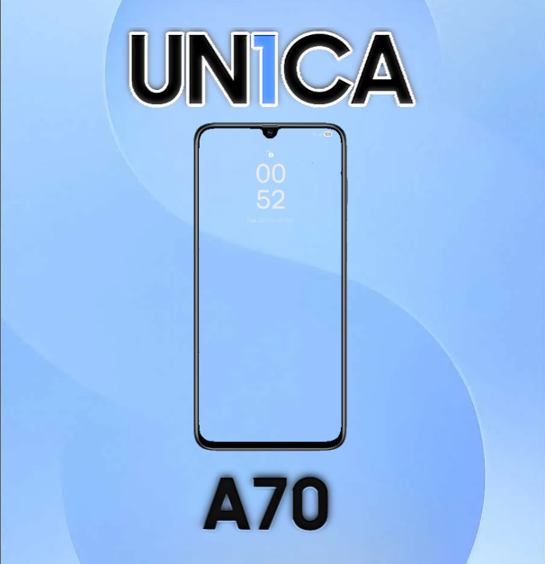

<h1 align="center">
  
</h1>

<h1>UN1CA-A70</h1>

This repo is meant to implement a couple of quirks to Un1ca's build system and add support for the Galaxy A70 (SM-A705FN). It WILL NOT generate a functional build!

